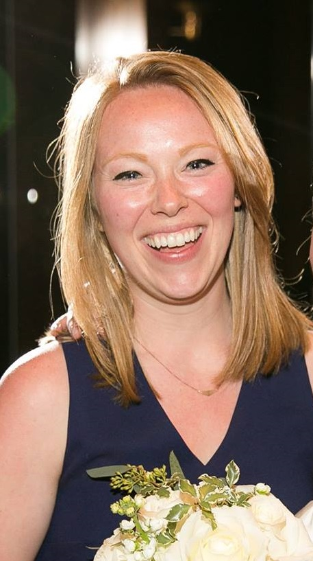

Hello! 

My name is Holly. I'm currently living in NYC and attending Columbia University Mailman School of Public Health. Originally from the San Francisco Bay Area, I received a BA in Economics from UCLA in 2014 and worked in consulting for several years prior to pursuing my Masters. I love beer, daschunds, and biostatistics (in that order). 

I am passionate about volunteering, especially for causes focused on sexual health and access to healthcare. Outside of my professional life, I have worked with the San Francisco AIDS Foundation, MedShare, and Harlem Prevention Center.

I love big data. In the last five years, I have learned how to manipulate data through multiple lenses - as a consultant and as a public health expert. Both lenses have taught me valuable lessons in how to communicate the main message and make an impact. 

Upon receiving my MPH, I hope to move back to the San Francisco Bay Area and work in health technology. 

##### MPH Candidate
##### Columbia University Mailman School of Public Health

